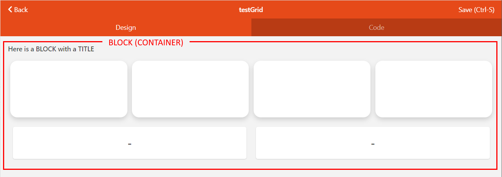

# oh-block - Layout Grid Block

<!-- GENERATED componentDescription -->
A block in a grid layout
<!-- GENERATED /componentDescription -->



[[toc]]

## Usage / reference documents

Grids elements provide a way to organize and position other visual components on the page in relation to each other.  Some of the key design concepts are explored [here (print)](https://visme.co/blog/layout-design/) or [here (UI design)](https://material.io/design/layout/responsive-layout-grid.html).  

In openHAB grid is used within [layout pages](../layout-pages.html) to organize and align controls.  Grids can also be used to layout the controls that make up a custom widget.  Both layout pages and individual controls can be made [responsive](/docs/ui/layout-pages.html#designing-responsive-layout-pages)) (their design changes based on the screen size).  A layout that is optimal on a mobile phone screen is often not on a laptop or large monitor. 

::: warning Widget design
`oh-block`, [`oh-grid-row`](./oh-grid-row.html) and [`oh-grid-col`](./oh-grid-col.html) are used for layout page design.  These controls are not suitable when designing custom widgets.  Use the [f7-block](https://v5.framework7.io/vue/block.html), [f7-row](https://v5.framework7.io/vue/grid.html) and [f7-column](https://v5.framework7.io/vue/grid.html) to organize components in custom widget designs.
:::

* Layout pages are discussed within the main documentation [here](/docs/ui/layout-pages.html).
* `oh-block` is the root a container object for [`oh-grid-row`](./oh-grid-row.html)/[`oh-grid-col`](./oh-grid-col.html) objects (which in turn, host the controls that provide the user interface).
* An `oh-block` is created in a layout page each time you click the `Add Block` button in the page design window.  At least one block is required for each layout page. 
* You can view / edit the layout page code by clicking the `Code` tab when in page design view (Administration/Settings/Pages).


* These components are based upon the corresponding [Framework 7 (v5) block control](https://v5.framework7.io/docs/block.html).
* Component styles are applied by the [Framework 7 CSS variables](https://v5.framework7.io/docs/block.html#css-variables).  Not all styles are implemented/available for use in this customised version of the control.  For guidance on how to customise styles see the [CSS Styles](https://openhab.org/docs/ui/building-pages.html#css-variables) section.

::: tip
Grid is not a table!  Grid components are virtual containers, so you can not view them or add borders as you would be able to do with a HTML table.
:::

## Configuration

<!-- GENERATED props -->

### General properties / Style

::: prop-head
- [`title`](#title) **Title** | Data type: TEXT
:::
::: prop-opt
Title of the block, displayed above it
:::

<!-- GENERATED /props -->

### Inherited Properties
The configuration is passed to the underlying `f7-block` component from Framework7 v5, however there are no compatible scalar properties available, due to the application specific purpose for this control.

### Slots
* `Default` hosts all child content to be placed within this container.
* There are no other slots supported by this control.

## Examples

<div id="header"></div>

### Header Image Source Code

This example code generates the example block and grid image used at the top of this page:
::: details Click to view the YAML source code:
```yaml{4-8}
config:
  label: testGrid
blocks:
  - component: oh-block
    config:
      title: Here is a BLOCK with a TITLE
    slots:
      default:
        - component: oh-grid-row
          config: {}
          slots:
            default: []
        - component: oh-grid-cells
          config: {}
          slots:
            default:
              - component: oh-cell
                config: {}
              - component: oh-cell
                config: {}
              - component: oh-cell
                config: {}
              - component: oh-cell
                config: {}
        - component: oh-grid-row
          config: {}
          slots:
            default:
              - component: oh-grid-col
                config: {}
                slots:
                  default:
                    - component: oh-label-card
                      config: {}
              - component: oh-grid-col
                config: {}
                slots:
                  default:
                    - component: oh-label-card
                      config: {}
masonry: []
```
:::

## Community posts
The following posts contain great examples of the use of this control:

* Got a cool example from the Community pages?  Use the GitHub edit page link to add links to this page!

<EditPageLink/>
